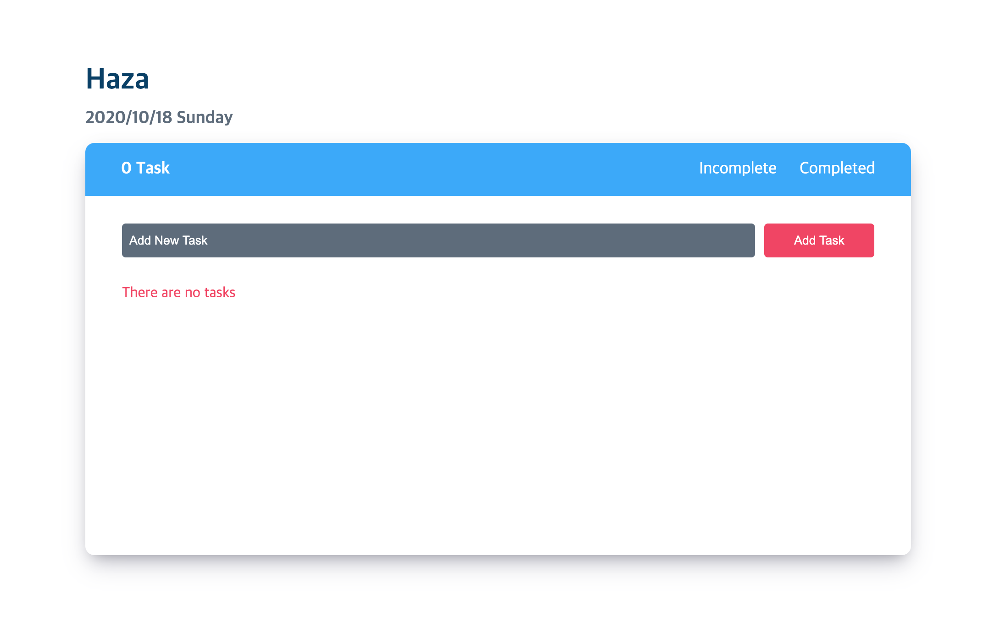

# Haza

> Simple ToDo List with React.js

## Table of contents

- [General info](#general-info)
- [Screenshots](#screenshots)
- [Technologies](#technologies)
- [Demo](#demo)
- [Setup](#setup)
- [Scope of Functionalities](#scope-of-functionalities)
- [Project Status](#project-status)
- [Contact](#contact)

## General info

Haza App is a simple todo list website created with React.js.

## Screenshots



## Technologies

- React.js

## Demo

Here is a working [live demo](https://danakim21.github.io/haza-app/#/)

## Setup

```sh
# Clone this repository
$ git clone https://github.com/danakim21/haza-app.git

# Go into the repository
$ cd haza-app

# Install dependencies
$ npm install

# Run the app and access it at localhost:3000
$ npm start
```

## Scope of Functionalities

List of features ready 

- Add tasks, Delete tasks, Complete tasks
- Incomplete completed tasks

To Do

- Use redux for better state control
- Change priority in list

## Project Status

Project is: _finished_

## Contact

Created by [@danakim21](https://danakim21.github.io/) - feel free to contact me!
